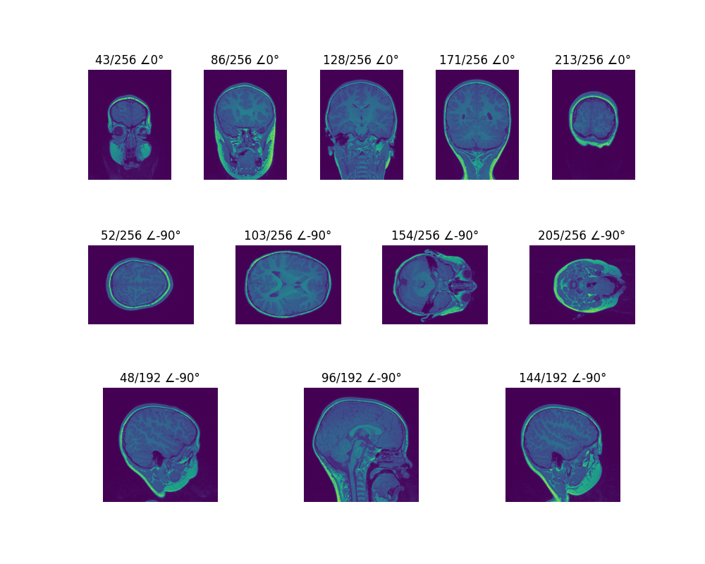

pl-chrisproject-matplotlib
================================

.. image:: https://img.shields.io/docker/v/fnndsc/pl-chrisproject-matplotlib?sort=semver
    :target: https://hub.docker.com/r/fnndsc/pl-chrisproject-matplotlib

.. image:: https://img.shields.io/github/license/fnndsc/pl-chrisproject-matplotlib
    :target: https://github.com/FNNDSC/pl-chrisproject-matplotlib/blob/master/LICENSE

.. image:: https://github.com/FNNDSC/pl-chrisproject-matplotlib/workflows/ci/badge.svg
    :target: https://github.com/FNNDSC/pl-chrisproject-matplotlib/actions

.. contents:: Table of Contents

Abstract
--------

Create static, animated, and interactive visualizations with Matplotlib for ChRIS

Description
-----------

``chrisproject_matplotlib`` is a *ChRIS ds-type* application that takes in nii data as input and generate slices on 3 dimensions (x,y,z) according to the user options. Users can specify the number of slices in each direction and also decide whether to rotate these sliced figures by specific degrees.

Usage
-----

.. code::

    docker run --rm fnndsc/pl-chrisproject-matplotlib chrisproject_matplotlib
        [-h|--help]
        [--json] [--man] [--meta]
        [--savejson <DIR>]
        [-v|--verbosity <level>]
        [--version]
        [-x|--xslices] [-y|--yslices] [-z|--zslices]
        [-rx|--rotatex] [-ry|--rotatey] [-rz|--rotatez]
        [-s|--size]
        <inputDir> <outputDir>

Arguments
~~~~~~~~~

.. code::

    [-h] [--help]
    If specified, show help message and exit.
    
    [--json]
    If specified, show json representation of app and exit.
    
    [--man]
    If specified, print (this) man page and exit.

    [--meta]
    If specified, print plugin meta data and exit.
    
    [--savejson <DIR>] 
    If specified, save json representation file to DIR and exit. 
    
    [-v <level>] [--verbosity <level>]
    Verbosity level for app. Not used currently.
    
    [--version]
    If specified, print version number and exit. 
    
    [-x] [--xslices] / [-y] [--yslices] / [-z] [--zslices]
    If specified, denotes the number of slices in the x/y/z axis. Default is 5.
    
    [-rx] [--rotatex] / [-ry] [--rotatey] / [-rz] [--rotatez]
    If specified, denotes the degree that all x/y/z slices figures needs to be rotated counter-clockwise. Default is 0.

    [-s] [--size]
    If specified, denotes the size of the picture. Default is 640,480.

Getting inline help is:

.. code:: bash

    docker run --rm fnndsc/pl-chrisproject-matplotlib chrisproject_matplotlib --man

Run
~~~

You need to specify input (containing NII files) and output directories (to which PNGs of the plots would be written to) using the `-v` flag to `docker run`.

.. code:: bash

    docker run --rm -u $(id -u)                                        \
        -v $(pwd)/in:/incoming -v $(pwd)/out:/outgoing                 \
        local/pl-chrisproject-matplotlib chrisproject_matplotlib      \
        /incoming /outgoing

Development
-----------

Build the Docker container:

.. code:: bash

    docker build -t local/pl-chrisproject-matplotlib .

Run unit tests:

.. code:: bash

    docker run --rm local/pl-chrisproject-matplotlib nosetests

Examples
--------

Overview of many common plotting commands in Matplotlib: https://matplotlib.org/stable/plot_types/index.html

Example plots: https://matplotlib.org/stable/gallery/index.html

If you use parameter like this

.. code:: bash

    docker run --rm -u $(id -u)             \
    -v $(pwd)/in:/incoming -v $(pwd)/out:/outgoing \
    local/pl-matplotlib chrisproject_matplotlib    \
    /incoming /outgoing -x 5 -y 4 -z 3 -s 1000,800 -rz -90 -ry -90

Then the result is like this

.. image:: https://raw.githubusercontent.com/FNNDSC/cookiecutter-chrisapp/master/doc/assets/badge/light.png
    :target: https://chrisstore.co
